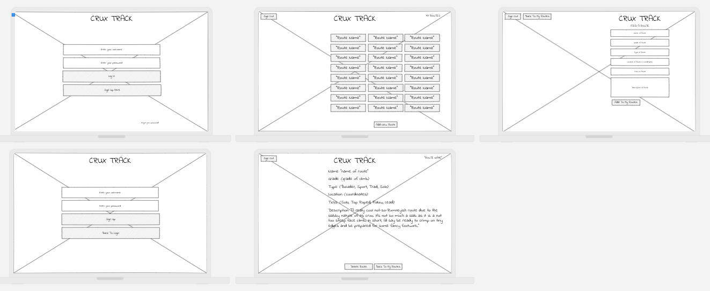

# PROJECT 2

- **Project Name:** CruxTrack
- **Project By:** Taylor Murdock
- [**LINK TO GITHUB**](https://github.com/TaylorMurdock/CruxTrack)
- [**LINK TO DEPLOYED WEBSITE**](https://cruxtrack.onrender.com/)
- **List of Technologies used:** HTML, JS, CSS, Node, Express, EJS, Mongo
- [**LINK TO TRELLO**](https://trello.com/b/SCZ1IfD6/cruxtrack)

## Description

# CruxTrack: Rock Climbing Route Management App

CruxTrack is a web application designed to help rock climbers track and manage their climbing routes. With CruxTrack, climbers can create an account, log their climbing routes, and keep a record of their progress and achievements. The app provides a simple and intuitive interface for climbers to manage their routes effectively.

## Mock UP of UI
  
  [**LINK TO DESKTOP VIEW**](https://app.uizard.io/prototypes/K7zbRm9YrrU5X8yRLJG0/player/fullscreen)
  made with https://app.uizard.io/
  

## List of Backend Endpoints

| ENDPOINT             | METHOD | PURPOSE                |
| -------------------- | ------ | ---------------------- |
| /users/login         | POST   | Login Page             |
| /users/register      | POST   | Register Page          |
| /cruxtrack/myroutes  | GET    | List of Routes         |
| /cruxtrack/route/id: | GET    | Specific Route Details |
| /cruxtrack/newRoute  | POST   | Add New Route To List  |

## ERD (ENTITY RELATIONSHIP DIAGRAM)

made with https://lucid.app/